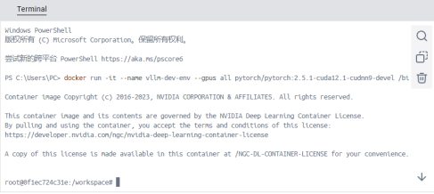
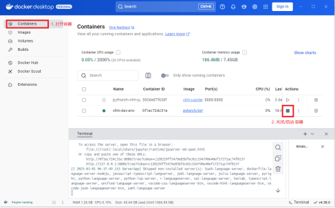

# vllm 在 windows 系统下的安装解决方案

## （一） 下载 Docker Desktop

1. 进入 Docker 官网：https://www.docker.com
2. 将鼠标放置在 **Download Docker Desktop** 按钮上，会弹出一个下载列表，如下图所示：


3. 选择 **Download for Windows - AMD64**，即可开始下载安装

## （二） 安装和更新 WSL

由于安装 Docker Desktop 需要使用到 WSL2 ，所以我们需要安装和更新 WSL2，下面是具体步骤：

1. 依次打开 **控制面板 - 程序 - 启用或关闭 Windows 功能** ，开启 Hyper-V、适用于 Linux 的 Windows 子系统、虚拟机平台
2. 打开 Windows PowerShell 检查 wsl 版本，键入命令： `wsl --version` ，如果正常返回则继续下一步
3. 将 WSL 版本切换到 WSL2：  `wsl --set-default-version 2` 
4. 从 github 下载并安装 WSL2 更新包（选择 `wsl.{version}.msi.x64.msi` 即可，其中 version 为最新版本号），网址：https://github.com/microsoft/WSL/releases
5. 键入命令  `wsl --version`  检查当前版本，返回的版本号与步骤4中下载的版本一致即可

## （三） 拉取 Docker 镜像并建立容器

1. 进入 Docker Desktop 应用，点击右下角的 _Terminal 打开终端界面
2. 注意到安装 vllm 需要 `ubuntu 20.04 + cuda12.1` 的环境，（如果 vllm 文档有更新，你需要根据具体更新来调整），使用如下命令拉取对应版本的 pytorch 镜像：
```shell
docker pull pytorch/pytorch:2.5.1-cuda12.1-cudnn9-devel`
```
3. 拉取镜像完毕后，执行下述命令启动一个该镜像的容器，执行该命令后你即可启动了一个名为 vllm-dev-env 的容器，并且进入了该容器内部：
```shell
docker run -it --name vllm-dev-env -p 8888:8888 --gpus all pytorch/pytorch:2.5.1-cuda12.1-cudnn9-devel /bin/bash
```

如下图所示：



## （四） 安装 vllm 和 jupyter

目前我们已经成功启动了一个适合于 pytorch 与 vllm 共存的容器，你可以直接在容器内部键入 python 命令来进行测试 pytorch 的运行效果，检查是否能读取到你的 GPU 卡，接下来我们使用如下命令（在容器内容执行）安装 vllm 即可：
```shell
pip3 install vllm
```
安装 jupyter :

```shell
pip3 install jupyter
```

## （五） 使用jupyter notebook

运行下述命令：
```shell
jupyter notebook --allow-root --ip=0.0.0.0
```
打开命令行中返回的 url 地址即可：
http://127.0.0.1:8888/tree?token={token}

## （六） 关闭和重启容器

